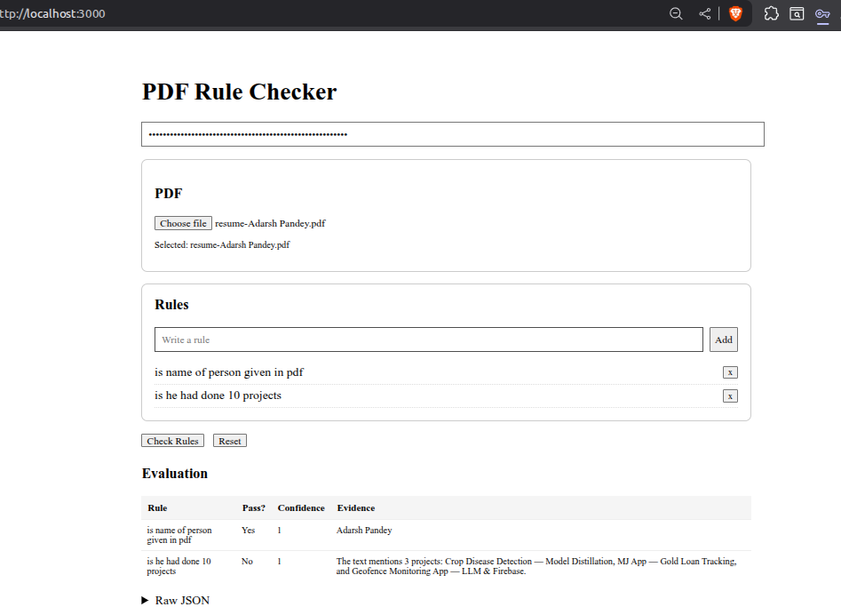
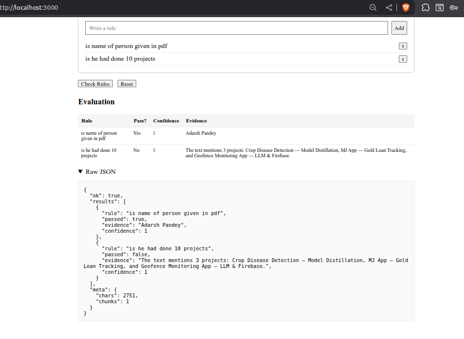

# PDF Rule Checker (Next.js Demo)

Single-page demo: upload a PDF, add rules, click check, see pass/fail + JSON. Current logic is stubby: random scores + simple text snippet search. Intended as scaffolding to plug real validation later.

## 🚀 Features

- 📄 Extract text from PDF using **pdf-parse**
- 🤖 Analyze large documents via **Groq LLaMA models**
- 🔍 Check custom rules strictly with **JSON-only answers**
- ✂️ Auto chunking when documents exceed token limits
- 💬 Front-end UI for uploading PDF + adding rules
- 📌 Output includes: `passed`, `evidence`, and validation metadata

## 🔧 Environment / API Key

You provide the Groq API Key on the UI (not .env), so the key never gets stored on server.
Supported model: llama-3.1-70b-versatile (or change to any Groq model).


## Quick Start

```bash
npm install --force
npm run dev
```

Open: http://localhost:3000

# PDF Legal Rule Checker (Next.js + Groq + PDF Extractor)


Upload a PDF, enter custom rules, and get AI-based validation using Groq LLMs.  
Supports large PDFs (auto-chunking) and outputs strict JSON rule evaluation.

> ⚠️ This is a demo tool, not a legal opinion engine.


## 📦 Install Dependencies

```bash
npm install pdf-parse groq-sdk 
npm install -D @types/node @types/react @types/react-dom @types/form-data
Try npm i --force if commands not works

```

## 🛠 Future Improvements (Optional Ideas)

📌 Highlight matched evidence in UI

📥 Save rules to local storage

🌐 Export result JSON file

♻️ Use streaming for chunk summarization


## Extending Later
- Replace random logic with deterministic validators.
- Add auth, persistence, rule categories, better PDF parsing.
- Improve snippet retrieval (context windows, highlights).

## Scripts
```bash
npm run dev    # start dev server
npm run build  # production build
npm start      # run built app
```

## Tech Stack
Next.js, React, TypeScript, pdf-parse.

## Disclaimer
Not production ready. Random outputs; security and validation minimal.
